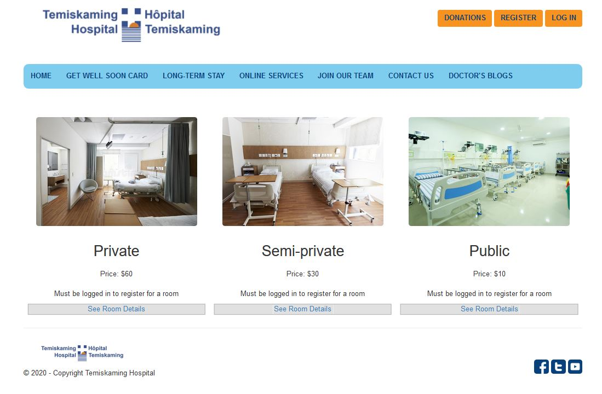
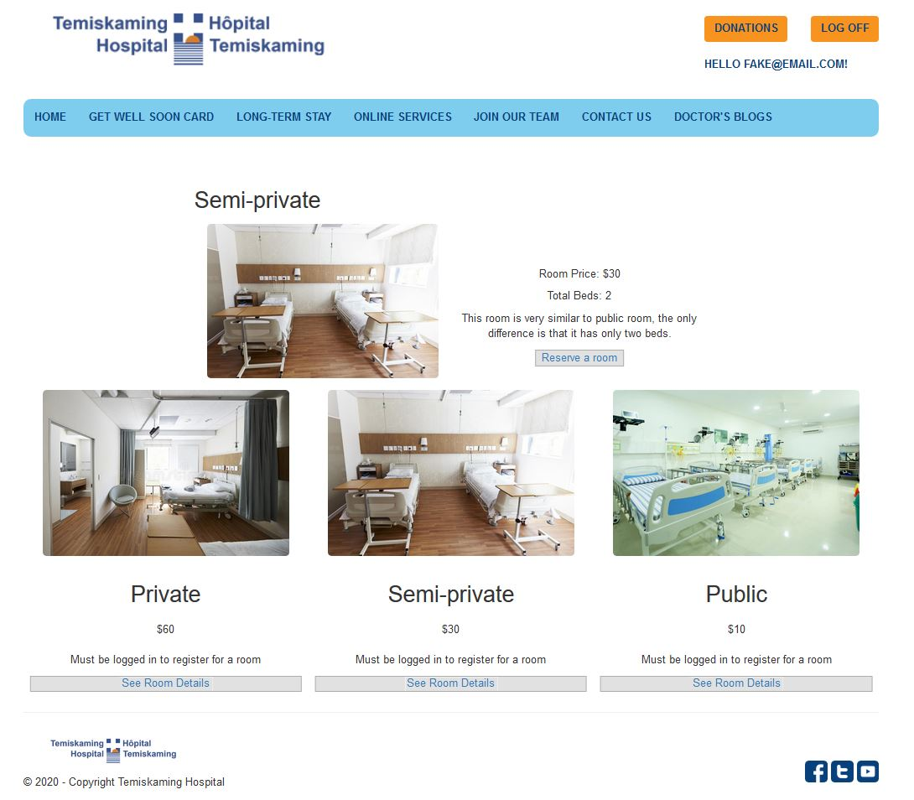
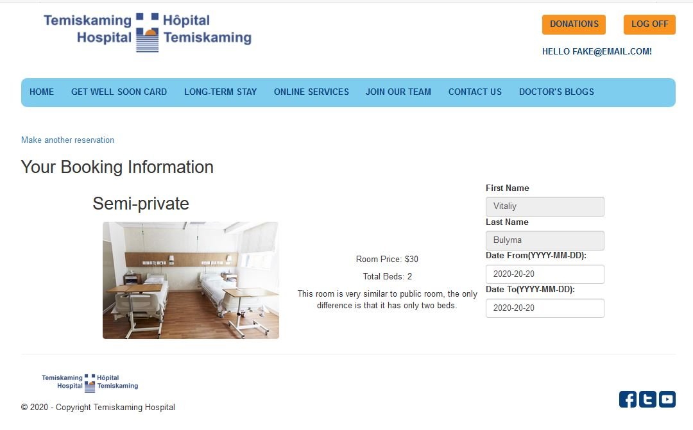

## Hospital Name: Temiskaming Hospital

In this team project, we redesigned an existing hospital website, and created several new features that we as a team believed would benefit and improve service to the user of the website and hospital visitors and patients. 

I created a Public Health Crisis Alert system and Long-Term Stay Booking System

## Team members: 
* Priyanka Khadilkar - n01351009
* Alexa Perez - n01353378
* Viet Phuong (Paul) Tran - n01400583
* Vitaly Bulyma  - n00224782
* Kshitija - 01363715
* Eseroghene Omene - N01374963
## Team members' features and contribution:

### Vitaliy: Public Health Crisis Alert and Long-term Stay at the Hospital
  **Public Health Crisis Alert**  

   * Description: This feature is only activated when the public health crisis is currently active, and has not been officially ended. All users will be able to see historical list of previous crises, and read articles related to each crisis.  If there is no active public health crisis, there will be no interaction with this feature by any users, and no access to it. To activate the alert on the main page (/Home/Index), the administrator of the page needs to log in, and navigate to /Crisis/Index where, as added security, they will be re-directed to appropriate page based on their permissions. When redirected, administrators can create new “Crisis” entry which will make this crisis active. To deactivate crisis alert, admin can update the crisis from the administrator interface. Administrators also able to add, edit, and delete articles accessible from /Article/Index, where they will be redirected to admin interface
    * Files Contributed:
      * Models:
        * Crisis.cs – represents information needed to describe the idea of “Crisis” entry, and list of all articles
        * Article.cs – represent information needed to describe an “Article” entry
      * ViewModels:
        * ShowCrisis.cs – allows to pass information about both article and crisis to same view
      * Views: 
        * Article:
          * Add.cshtml – administrator interface where they can add new article
          * Index.cshtml – the page which re-directs user to appropriate interface based on their permissions.
          * List.cshtml – Public list of all articles and crises list in the system
          * ListAdm.cshtml – Administrator interface in addition to see a list of all articles and crises, it displays controls that allow to update or delete the record
          * Update.cshtml – Administrator page, where they can update specific record selected from administrator list interface
          * ViewArticle.cshtml – Public page to read selected article from list of all articles
        * Crisis:
          * Add.cshtml - administrator interface where they can add new crisis, and automatically create an alert on main page
          * Index.cshtml – this page redirects user to appropriate public or administrator list of all crisis’s records
          * List.cshtml – public list of crises 
          * ListAdm.cshtml – Administrator view of crises list, where they have controls to update, edit, or delete record
          * Update.cshtml – Administrator page, where they can update specific record selected from administrator list interface
          * ViewCrisis.cs - Public page where users can see all articles related to the crisis
      * Controllers:
        * ArticleController.cs, CrisisControler.cs – enables functionality and interaction between models, views, and databases
        
 **Long-term Stay at the Hospital**
 
 List of all Rooms
 
 
 
 One Room Details
 
 

Booked Room Details

 

        

 * Description: This feature is designed for hospital users to explore which rooms are available for long-term stay. The list of all rooms available from main menu from main navigation accessible at /Room/ShowAll. In addition to browsing rooms and read their descriptions, logged in users will be able to book a selected room for specified dates.
    
    * Files Contributed:
      * Models:
        * Room.cs – represents information needed to describe the idea of “Room”, also bookings associated with that room 
        * RoomBooking.cs – represent information needed to describe a “Booking” entry, includes room information and user information associated with it.
      * ViewModels: 
        * FeaturedRoom.cs – allows to pass information about both selected room and all rooms available to view
        * RoomBookings.cs - allows to pass information about both booked room and user who booked the room to one view
      * Views:
        * ShowAll.cshtml – Displays all room types available at the hospital
        * ShowOne.cshtml – Shows one room, selected from the list, with more details. If person viewing the page is not registered, it prompts to log in to book the room. 
        * RoomBooking.cshtml – Retrieves the information of logged in user, and room selected from the list to populate the room booking registration form. 
        * Confirm.cshtml – Displays information about the room and user associated with that room after booking the room.
        * AdminView.cshtml – Administrator interface, where all information about number of rooms, rooms occupancy, and occupants is displayed (*not completed, this view is not database driven at the moment)
      * Controllers:
        * RoomController.cs – enables functionality and interaction between models, views, and databases
      

### Paul: Log in system + Get Well Soon Card
  * Log in system
    * Description: Users will be classified into 3 types with different roles that they have on the site: Admin, Editor, Registered User
    * Files contributed: 
      * Model
        * AccountViewModels: add in the AdminRegister Model where only admin can add and assign role to users.
        * RoleViewModels: a class contains all the role name in the website
      * View:
        * AdminRegister (under Account folder): this is the interface allows admin to assign roles and register for employees.
        * Role folder: these interfaces allow admin to add, update, delete and view all the roles.
      * Controllers:
        * Account Controller: modify the Register function so anyone who register becomes Registered User. Add in the AdminRegister to allow admin to assign roles for different people
        * Role Controller: algorithm behind the Roles view and models.
  * Get Well Soon Card:
    * Description: Logged in user can see, add, update and delete a card for the patient who is now in the hospital
    * Files contributed:
      * Model:
        * GetWellSoonCard.cs, CardDesign.cs: These two are in a one to many relationship. One Card has one design but one designs can be applied in many cards
        * ShowGetWell.cs, PersonalListGetWell.cs, ListGetWell.cs, UpdateGetWell.cs, AddGetWellCard.cs: These viewmodels are used to display information in respecitve page
      * View:
        * CardDesign folder: showing all the card designs for admin and editor to view, add, edit and delete
        * GetWellSoonCard folder: 
          * List: a page displaying all cards for admin, editor to view
          * Personal List: a page displaying all cards for a particular users who logged
          * Index: a page for guests to logged in and create the card
          * Add, Delete, Show, Update: the interface for users to interact with the page with different actions.
       * Controllers: 
        * CardDesignController, GetWellSoonCardController: the algorithm behind the CardDesign's and GetWellSoonCard's views and models

### Alexa: Doctor's Blogs + Live Wait Times
  * Doctor's Blogs
    * Description: This Feature can be accessed by all users and guests, Editors(Doctors) will be able to write blog entries about their general interests, which can be related to medicine, and they will only be able to see,edit or delete their own blog entries. Admins will have full access to all blog entries and functionalities. Guests and Registered Users will only be able to see the entries.
    * Files contributed:
      * Model:
        * DoctorsBlog.cs, BlogTopic.cs: These have a many to many relationship since one blog can have many topics, and one topic can have many blog entries. A bridging table was created betweeen the two to be able to manipulate data.
        * AddBlogTopic.cs, DoctorPersonalBlogList.cs: These are the ViewModels created to be able to show the information we want that relates between our tables. Add Blog Topic is so we are able to show the topics on different views and the Doctor Personal Blog List is to show only one doctors blogs.
      * View:
        * DoctorsBlog:
          * Add.cshtml  // Can only be accessed by Admin or Editor users
          * Delete.cshtml  // Can only be accessed by Admin or Editor users
          * DoctorPersonalList.cshtml  // Can only be accessed by Editor users to show their entries
          * Index.cshtml
          * List.cshtml  // Can only be accessed by Admin or Editor users
          * PublicList.cshtml  // Can be accessed by Guests or Registered Users
          * PublicShow.cshtml  // Can be accessed by Guests or Registered Users
          * Show.cshtml  // Can only be accessed by Admin or Editor users
          * Update.cshtml  // Can only be accessed by Admin or Editor users
        * Blog Topic: 
          * Add.cshtml  // Can only be accessed by Admin or Editor users
          * Delete.cshtml  // Can only be accessed by Admin or Editor users
          * List.cshtml  // Can only be accessed by Admin or Editor users
          * PublicList.cshtml  // Can be accessed by Guests or Registered Users
          * PublicShow.cshtml  // Can be accessed by Guests or Registered Users
          * Show.cshtml  // Can only be accessed by Admin or Editor users
          * Update.cshtml  // Can only be accessed by Admin or Editor users
       * Controllers: 
        * DoctorsBlogController, BlogTopicController: This is where we write all the functionality between our models and views, connecting them to the database.
        
 * Live Wait Times
    * Description: Only Admin users have full access to this feature, where they will update the current wait time of the different departments in the hospital, they can add, edit or delete entries. Guests, Registered Users and Editors can view the main Live Wait Times list, where a list od the departments is shown, and see the updates of each department.
    * Files contributed:
      * Model:
        * LiveWaitTime.cs, Department.cs: These tables have a many to one relationship, One Live Wait Time update can only have one department, but a department can be referenced on many updates.
      * View:
        * LiveWaitTime:
         * Add.cshtml  // Can only be accessed by Admin or Editor users
         * Delete.cshtml  // Can only be accessed by Admin or Editor users
         * Index.cshtml
         * List.cshtml  // Can only be accessed by Admin or Editor users
         * PublicList.cshtml  // Can be accessed by Guests or Registered Users
         * PublicShow.cshtml  // Can be accessed by Guests or Registered Users
         * Show.cshtml  // Can only be accessed by Admin or Editor users
         * Update.cshtml  // Can only be accessed by Admin or Editor users
       * Controllers: 
        * LiveWaitTimeController: This is where we write all the functionality between our models and views, connecting them to the database.
  * Contributions: Styling of header, footer and navigation.
  
  ### Priyanka : Events + Online Appointment
  * Events
     * Description: Only Admin users have full access to this feature, where they can create, update, delete, register and view the events.Also they can see the list of users registered for an event.Registerd Users, Editors can see all list of events, view event details and register for the events.They can also see the past registered events.Guest Users of website can see the list of events, however they can not register for events.
     * Files contributed:
       * Model:
         * Event.cs, ApplicationUser.cs, ViewModel/RegisteredUserList.cs : These tables have many to many relatioship, One user can register for multiple events, same time multiple events can be registerd by multiple users.
       * View
         * Events
           * Add.cshtml // Can only be accessed by Admin
           * List.cshtml // Can be accessed by Guest user, Editor, Admin and Registered User, However according to role there will be certain restrictions to access features
           * RegisteredUserList.cshtml //Can only be accessed by Admin
           * RegistrationList.cshtml // Can be accessed by All loggedin users(Admin, Editor User, Registered User)
           * Show.cshtml // Can be accessed by All loggedin users(Admin, Editor User, Registered User)
           * Update.cshtml //Can only be accessed by Admin
        * Controllers: 
          * EventController: This is where we write all the functionality between our models and views, connecting them to the database.
     
  * Online Appointment
      * Description: Only Admin, Editor users have full access to this feature, where they can book, update, view the Booked appointments and update the Booked Appointments. Registerd Users can book, see list of all booked appointment in past and cancel the appointment.
      * Files contributed:
        * Model:
          * OnlineAppointmentBooking.cs, ApplicationUser.cs : These tables have one to many relationship, One user can book multiple appointments.
        * View:
          * OnlineAppointmentBooking
            * Book.cshtml // Can be accessed by all logged in users(Admin, Editor User, Registered User)
            * List.cshtml // Can be accessed by Guest user, Editor, Admin and Registered User, However according to role there will be certain restrictions to access features
            * Update.cshtml // Can be accessed by admin user
            * View.cshtml // Can be accessed by Guest user, Editor, Admin and Registered User, However according to role there will be certain restrictions to access features
        * Controllers: 
          * OnlineAppointmentBookingController: This is where we write all the functionality between our models and views, connecting them to the database.
  * Contributions: 
    * Styling of responsive bootstrap forms and tables. 
    * Implemented CKeditor,boostrap clock picker, datepicker
    * Resolved git conflicts and migration conflicts.
   
   ### Eseroghene Omene - Job Listings and Volunteer Positions
   ##Job Listing
  Description:  A job listing can be created by an admin staff and viewed by all.  When viewed by a registered user only the job postings which are published will be displayed. 
    All users are able to search the job postings and find accoring to job title, job description or department. 
    An Admin has the ability to create, read, update and delete positions as well as add new departments.  An editor is able to do the same except for adding new departments. 
    One user can post several job postings, and a department can have several job postings.  But one job posting is only related to one department.  If an admin needs to fill the same position in a different department (ie. receptionist)  they will have to create a new posting, to avoid any confusions.   
    A registered user, or general public visitor to the site will be able to view the list of jobs and the details pertaining to the job. 
    **File Contributions
    JobListingController
    JobListing Model
    AddJobListing ViewModel
    ShowJobListing ViewModel
    UpdateJobListing ViewModel
    JobListing Views - Add, Delete, Index, List, Show, Update

##Volunteer Positions
Description: A volunteer position can be created by an admin staff and viewed by all, including who is currently volunteering.  Registered users are able to sign up for a volunteer position.  A position can have many volunteers, and a volunteer can sign up for as many positions as they choose. 
Five volunteer positions are listed on each page.
A department can have many volunteer positions, and each volunteer position can only have one department in order to avoid any confusion. 
Only Admin and Editor can add new, update or delete a volunteer position. 
**File Contributions
VolunteerPositionController
VolunteerPosition Model
AddVolunteerPosition ViewModel
ShowVolunteerPosition ViewModel
UpdateVolunteerPosition ViewModel
VolunteerPosition Views - Add, Delete, List, Show, Update

**People/Code Help
Paul - Authorized Users, Managing View Models, migration management,attention to detail
Priyanka - styling development, join query, migration management
Alexa - helped keep me sane! and also attention to detail and migration management

 ### Kshitija Patel - Feedback Form + Medical Staff Directory
 * Feedback Form
     * Description: Registered User can add their feedback through this feature.They can also view the list of feedbacks they have submitted and can also delete any of thier feedback if they wish.Admin can see the list of all the feedbacks and can delete any feedback if it seems to be improper.
     * Files contributed:
       * Model:
         * Feedback.cs : These tables have one to many relatioship, One user can give many feedbacks, but one feedback is assigned to that particular user who submitted the feedback.
       * View
         * Events
           * Add.cshtml // Can only be accessed by User only.
           * List.cshtml // Can be accessed by Admin and Registered User. However User can see the list of feedbacks they gave but Admin can view all feedbacks by all users.
           * Delete.cshtml //Can be accessed by Admin and Registered User.
           * Show.cshtml //Can only be accessed by Admin and Register User. 
        * Controllers: 
          * FeedbackController: This is where we write all the functionality between our models and views, connecting them to the database.
     
  * Medical Staff Directory
      * Description: Here Guest User And Registered User can view the list of all the departments, staff members, and their contact details. Admin has the access to add, update and delete the staff members in the staff directory.
      * Files contributed:
        * Model:
          * MedicalStaffDirectory.cs, ViewModel/AddUpdateMedicalStaffDirectory.cs : These tables have many to many relationship, One staff member can be in many departments and one department can have multiple staff members.
        * View:
          * MedicalStaffDirectory
            * Add.cshtml // Can be accessed by Admin only
            * List.cshtml // Can be accessed by Guest user, Editor, Admin and Registered User. However Admin have addition access to the actions in the list such as update and delete.
            * Update.cshtml // Can be accessed by Admin only.
            * Delete.cshtml // Can be accessed by Admin only.
		  * Departments
			* Add.cshtml // Can be accessed by Admin only
            * List.cshtml // Can be accessed by Admin only.
            * Update.cshtml // Can be accessed by Admin only.
            * Delete.cshtml // Can be accessed by Admin only.
        * Controllers: 
          * MedicalStaffDirectoryController: This is where we write all the functionality between our models and views, connecting them to the database. 
           
     
  
  
